# Cable Inspection Robot Based on RDK X5

This repository provides a ROS2/TROS reference implementation for an RDK X5 based cable inspection robot. The robot uses a differential-drive chassis to patrol along cables, detects cable offset and defect candidates from RGB camera images, and can optionally integrate LiDAR, IMU, wheel odometry, Cartographer, Nav2, RViz2, and Web visualization modules.

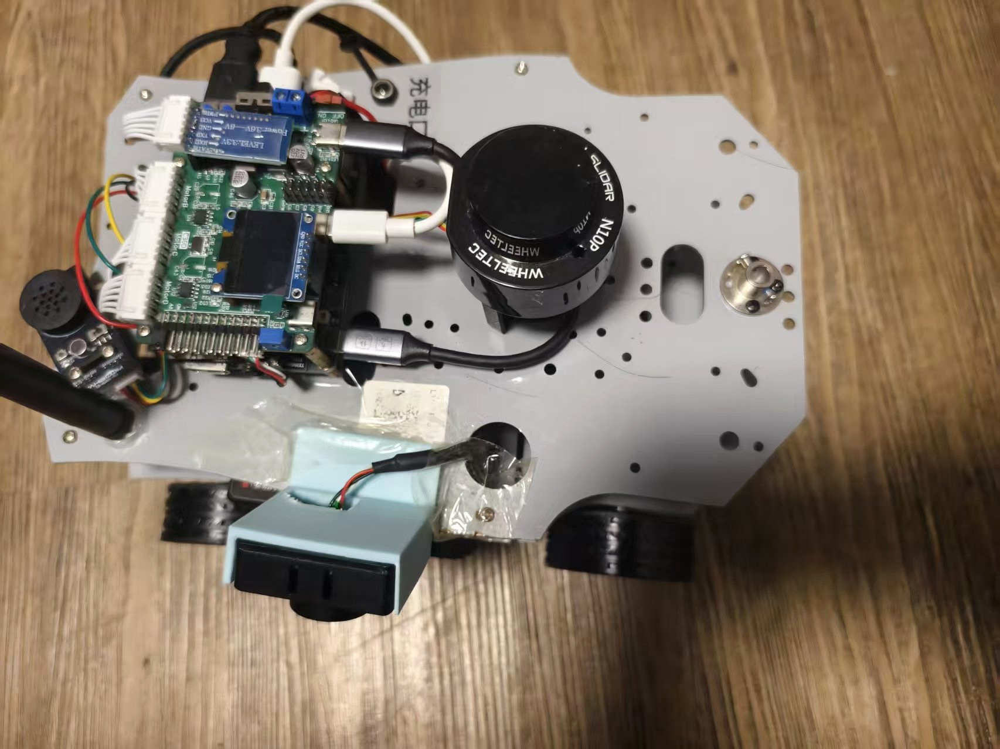

## Highlights

- RDK X5 is used as the main computing platform for ROS2/TROS perception, planning, control, and logging.
- The WHEELTEC C30D ROS four-wheel controller works as the low-level chassis controller for motor closed-loop control and real-time execution.
- The lower board position follows the Raspberry Pi 4 Model B form factor, making it convenient to validate the mechanical and 40-pin ecosystem compatibility.
- The software covers the full loop of perception, localization, planning, control, and data recording.
- The project keeps hardware-free fallback paths, so developers can test the PID controller, serial protocol, and perception-control interfaces without the physical robot.

## System Architecture

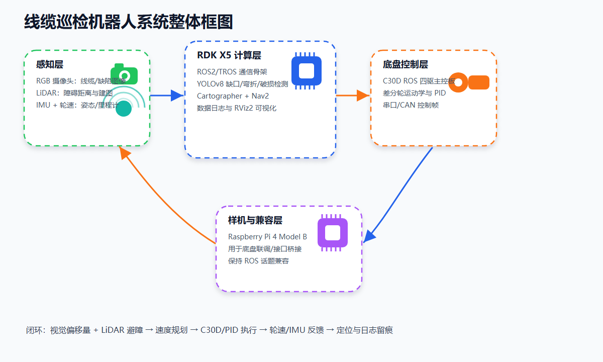

Control loop:

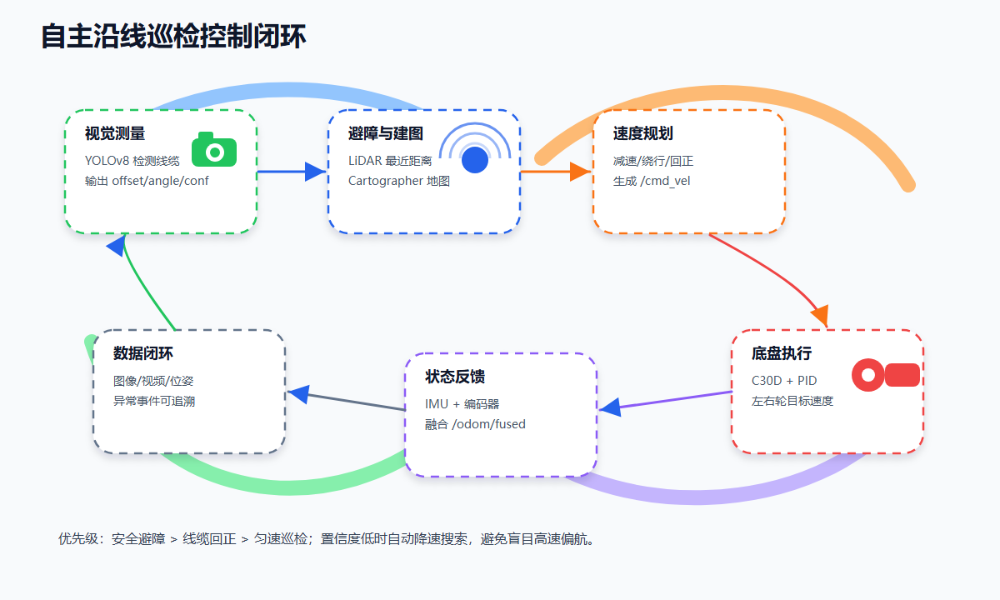

### Report Figure Gallery

The following figures are extracted from the final design report. They summarize the functional scope, hardware wiring, chassis communication, control state machine, Web dashboard, SLAM pipeline, and BPU deployment workflow.

| Function overview | Engineering workflow |
|---|---|
| 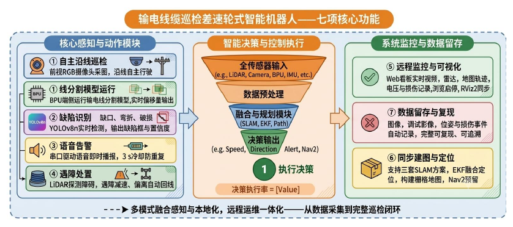 | 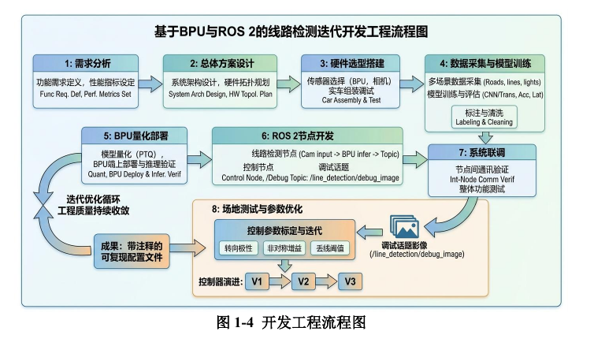 |

| Hardware interface | Chassis communication flow |
|---|---|
| 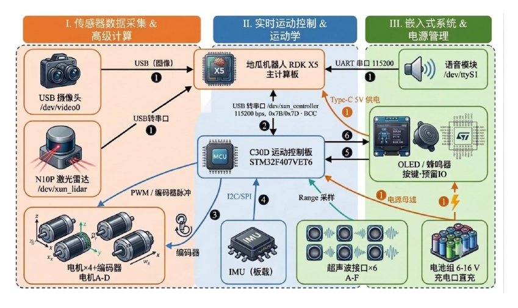 | 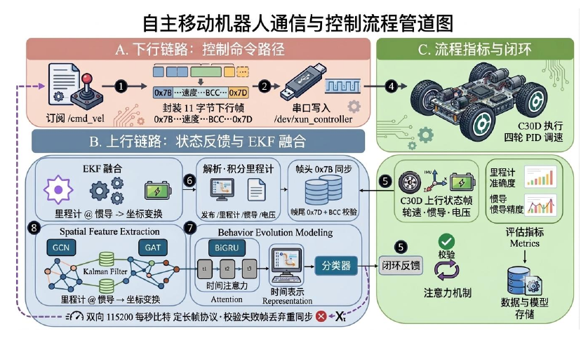 |

| Five-state tracking state machine | Web dashboard service |
|---|---|
| 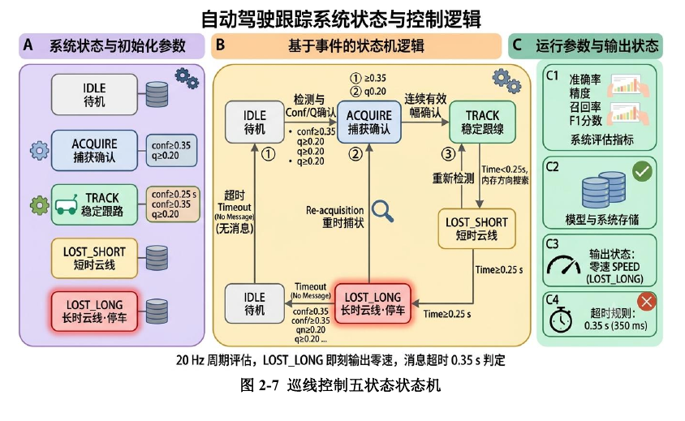 | 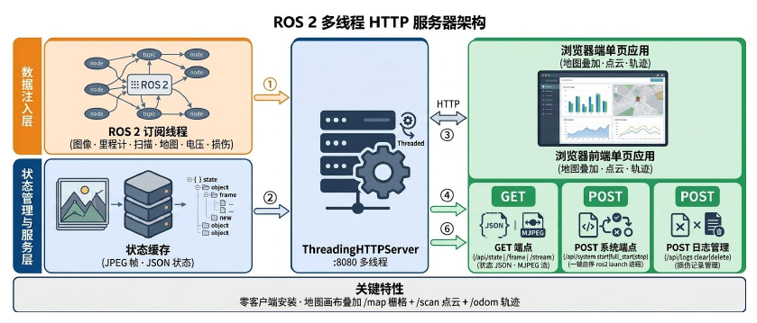 |

| SLAM and navigation data flow | BPU quantization and deployment |
|---|---|
| 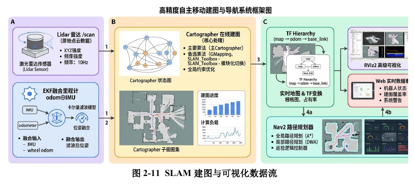 | 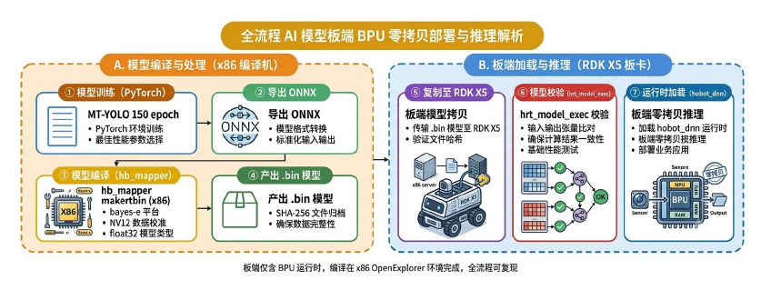 |

| C30D controller framework | Cartographer framework |
|---|---|
| 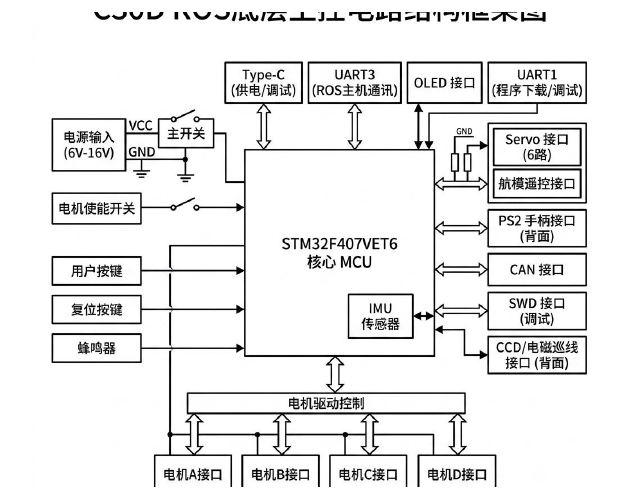 | 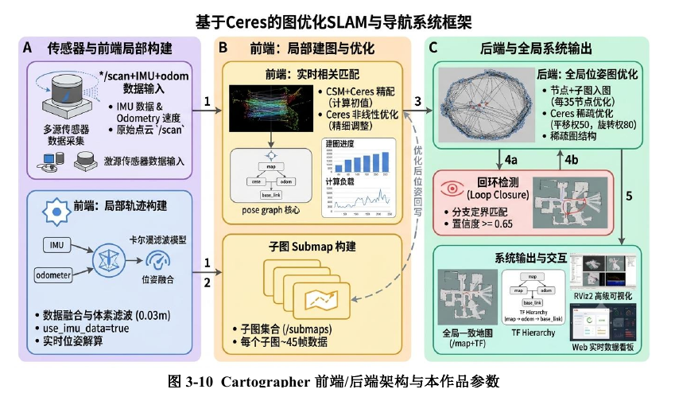 |

Data flow:

1. `/camera/image_raw` receives RGB images.
2. `yolo_cable_detector` publishes `/perception/cable_offset` and `/perception/debug_image`.
3. `inspection_planner_node` fuses visual offset, LiDAR obstacle distance, and fused odometry, then publishes `/cmd_vel`.
4. `motor_pid_controller` converts `/cmd_vel` into left and right wheel targets and sends UART/USB frames to the C30D controller.
5. `data_logger_node` records images, offsets, odometry, states, and key events for reproducible experiments.

## Repository Layout

```text
cable-inspection-robot-rdkx5/
├── cable_inspection_robot/
│   ├── camera_node.py
│   ├── yolo_cable_detector.py
│   ├── inspection_planner_node.py
│   ├── motor_pid_controller.py
│   ├── odom_fusion_node.py
│   ├── data_logger_node.py
│   ├── serial_protocol.py
│   ├── kinematics.py
│   └── pid.py
├── config/
│   ├── inspection_params.yaml
│   ├── nav2_params.yaml
│   └── cartographer_2d.lua
├── launch/
│   └── inspection_bringup.launch.py
├── tests/
│   ├── check_utf8.py
│   └── test_pid.py
└── docs/
    ├── DEPLOYMENT.md
    └── NODEHUB_SUBMISSION.md
```

## Nodes and Topics

| Module | File | Subscribes | Publishes | Purpose |
|---|---|---|---|---|
| Camera capture | `camera_node.py` | - | `/camera/image_raw` | Publishes RGB images as ROS image messages |
| Cable detection | `yolo_cable_detector.py` | `/camera/image_raw` | `/perception/cable_offset`, `/perception/debug_image`, `/perception/defect_event` | Outputs cable offset, angle, confidence, and defect events |
| Inspection planner | `inspection_planner_node.py` | `/perception/cable_offset`, `/scan`, `/odom/fused` | `/cmd_vel`, `/inspection/state` | Generates chassis velocity commands from visual offset and obstacle data |
| Motor control | `motor_pid_controller.py` | `/cmd_vel` | `/wheel/odom`, `/motor/debug` | Differential-drive kinematics, dual-wheel PID, and C30D serial frames |
| Odometry fusion | `odom_fusion_node.py` | `/wheel/odom`, `/imu/data` | `/odom/fused`, `odom -> base_link` TF | Uses IMU yaw to lightly correct wheel odometry drift |
| Data logging | `data_logger_node.py` | Offset, odometry, state, debug image | CSV/image files | Records inspection data for reproduction and analysis |

## Quick Start

```bash
mkdir -p ~/rdkx5_ws/src
cd ~/rdkx5_ws/src
git clone https://github.com/xklihai/cable-inspection-robot-rdkx5.git cable-inspection-robot-rdkx5
cd ~/rdkx5_ws
rosdep install --from-paths src --ignore-src -r -y
colcon build --packages-select cable_inspection_robot
source install/setup.bash
```

Run hardware-free checks:

```bash
python3 src/cable-inspection-robot-rdkx5/tests/check_utf8.py
python3 src/cable-inspection-robot-rdkx5/tests/test_pid.py
ros2 launch cable_inspection_robot inspection_bringup.launch.py
```

Enable C30D serial output in `config/inspection_params.yaml`:

```yaml
motor_pid_controller:
  ros__parameters:
    serial.enabled: true
    serial.port: /dev/ttyUSB0
    serial.baudrate: 115200
```

## RDK X5/TROS Adaptation

`yolo_cable_detector.py` keeps an OpenCV/Hough fallback implementation so that the control loop can be reproduced without a model file. On RDK X5, replace `run_inference()` with a TROS/hobot_dnn inference backend while keeping the `DetectionResult` interface unchanged:

```python
DetectionResult(
    offset_norm=...,        # normalized cable center offset, roughly [-1, 1]
    angle_rad=...,          # cable direction angle
    confidence=...,         # detection confidence
    class_id=...,           # 0 normal, 1 gap, 2 bend, 3 damage
    bbox_xyxy=(x1, y1, x2, y2),
)
```

## License

This project is released under the Apache License 2.0. Model weights, third-party datasets, hardware vendor materials, and related documents may have their own licenses.
